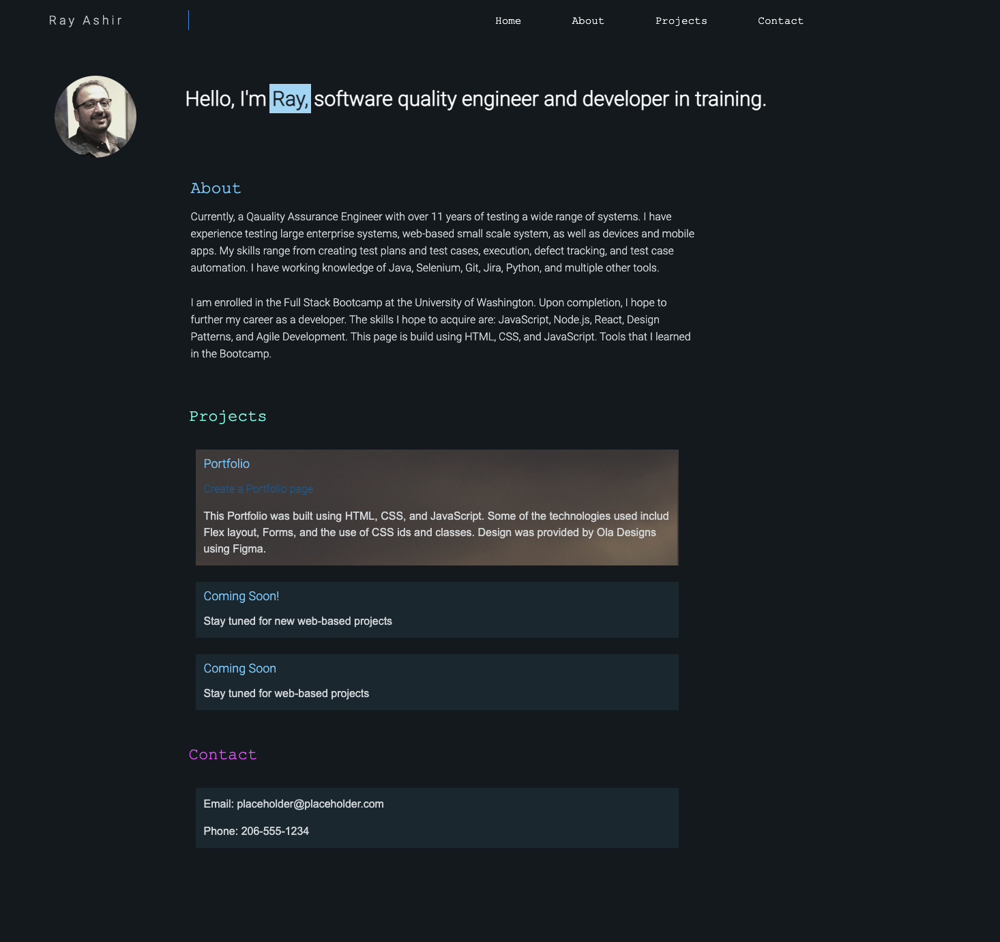

# portfolio

## Welcome
This repo contains the webpage and corresponding css for my portfolio. It contains a nav bar, intro, about, projects, and contact sections. Enjoy. 

## Nav Bar
The nav bar is responsive

The navbar will indicate the item that is being hovered over

## Home Section
Includes a current picture and intro 

used flex to arrange the elements in a column

## About section 
current experience and training

## Projects Section
The projects will show a static image when hovering on them

## Contact me
Currently this is a placeholder that does not have my real email. It will be replaced with a form once I learn JS. 

## Mock-Up

The below picture captures the finished product

